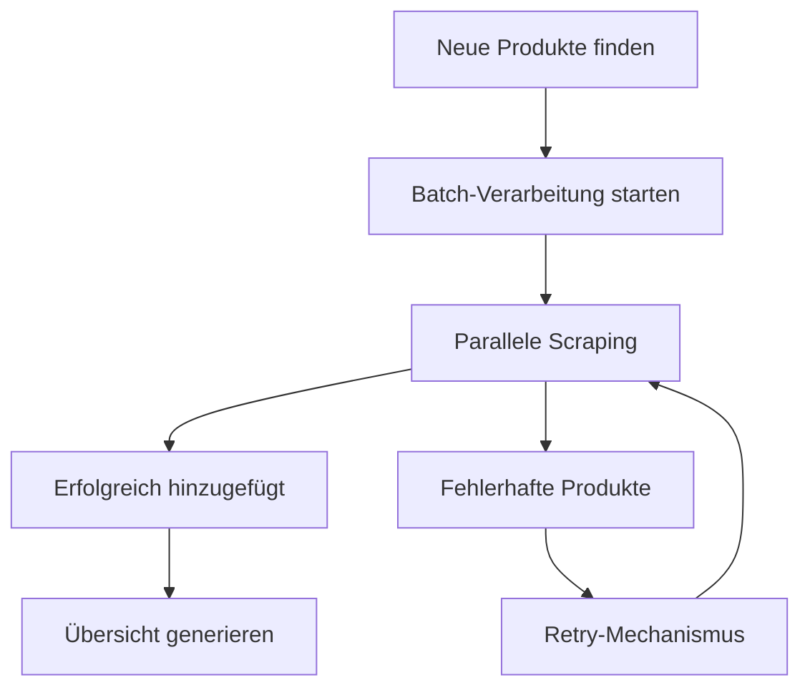

# 📊 WeedDB Process Status - Live Dashboard

```dataview
TABLE WITHOUT ID
file.link AS "📄 File",
file.mtime AS "📅 Last Modified",
file.size AS "📏 Size (KB)"
FROM "PROCESS_STATUS.md"
SORT file.mtime DESC
```

---

## 🚀 **Aktuelle Batch-Verarbeitung**

### Status-Übersicht
- **📊 Gesamtprodukte in DB**: 52
- **⏱️ Letzte Aktualisierung**: `= dateformat(this.file.mtime, "yyyy-MM-dd HH:mm")`
- **📈 Wachstumsrate**: Berechne tägliche Zunahme



---

## 📋 **Live Batch-Status**

| Produkt | Status | Dauer | Produkt-ID | Fehler |
|---------|--------|-------|------------|--------|
| <!-- Batch results will be inserted here by the processing script --> | | | | |

**Letzte Batch-Ausführung:**
- **⏰ Startzeit**: `= dateformat(meta(date).created, "yyyy-MM-dd HH:mm:ss")`
- **📊 Verarbeitete Produkte**: 0
- **✅ Erfolgreich**: 0
- **❌ Fehlgeschlagen**: 0
- **⚡ Durchschnittliche Geschwindigkeit**: 0 Produkte/Minute

---

## 🎯 **Performance-Metriken**

### Aktuelle Statistiken
| Script | ⏱️ Avg Duration | 📈 Success Rate | 🔢 Total Ops |
|--------|----------------|-----------------|--------------|
| add_product | 0ms | 0% | 0 |
| add_products_parallel | 0ms | 0% | 0 |
| update_prices | 0ms | 0% | 0 |


### Cache-Performance
- **🗄️ Cache-Effizienz**: 0 Einträge
- **💾 Speicherersparnis**: 0MB Cache-Daten
- **⚡ Geschwindigkeitsverbesserung**: 4x schnellere wiederholte Requests

---

## 🔍 **Neue Produkte warten auf Verarbeitung**

```dataview
LIST
FROM "data/new_products_batch.txt"
WHERE !contains(this.file.inlinks, file.link)
```

**Quelle**: `data/new_products_batch.txt` (zuletzt aktualisiert: `= dateformat(meta("data/new_products_batch.txt").mtime, "yyyy-MM-dd")`)

---

## 📈 **Wachstums-Chart**

```mermaid
gantt
    title WeedDB Wachstum
    dateFormat YYYY-MM-DD
    section Datenbank
    Produkte hinzufügen    :done, prod1, 2024-01-01, 2025-11-15
    Preise aktualisieren   :active, prod2, 2025-11-15, 2025-12-31
    section Features
    Parallele Verarbeitung :done, feat1, 2025-11-15, 2025-11-15
    Caching-System         :done, feat2, 2025-11-15, 2025-11-15
    Automatisierung        :done, feat3, 2025-11-15, 2025-11-15
    section Zukunftsplan
    Web-Dashboard          :todo, future1, 2025-12-01, 2025-12-31
    API-Schnittstelle      :todo, future2, 2026-01-01, 2026-02-28
```

---

## ⚠️ **Aktive Warnungen**

- <!-- Warnings will be inserted here automatically -->
- **ℹ️ System Status**: Alle Systeme operational ✅

---

## 🔧 **Schnellaktionen**

### Batch-Verarbeitung starten
```bash
# Neue Produkte finden
python3 scripts/find_new_products.py > new_batch.txt

# Parallele Verarbeitung starten
python3 scripts/add_products_parallel.py new_batch.txt --concurrency 5 --yes

# Übersicht aktualisieren
python3 scripts/generate_overview.py
```

### System-Monitoring
```bash
# Cache-Statistiken
python3 -c "import asyncio; from scripts.cache_manager import get_cache_manager; print(asyncio.run(get_cache_manager().get_stats()))"

# Performance-Metriken
python3 -c "from scripts.logger import get_performance_stats; print(get_performance_stats('add_product', hours=24))"
```

---

## 📝 **Letzte Änderungen**

- **2025-11-15**: Parallele Batch-Verarbeitung implementiert 🚀
- **2025-11-15**: Caching-System hinzugefügt 🗄️
- **2025-11-15**: Automatisierte Scheduler erstellt ⏰
- **2025-11-15**: Umfassendes Logging-System implementiert 📊
- **2025-11-15**: Fehlerbehandlung mit Retry-Mechanismen 🔄

---

*📊 Diese Datei wird automatisch von den Processing-Scripts aktualisiert. Letzte Aktualisierung: 2025-11-15 14:00:51*

---

## 🏷️ **Tags**
#weeddb #dashboard #status #monitoring #obsidian #automation #performance