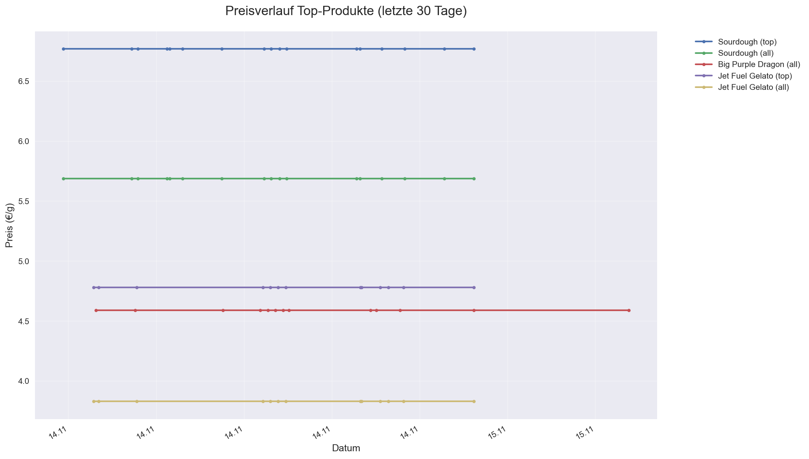
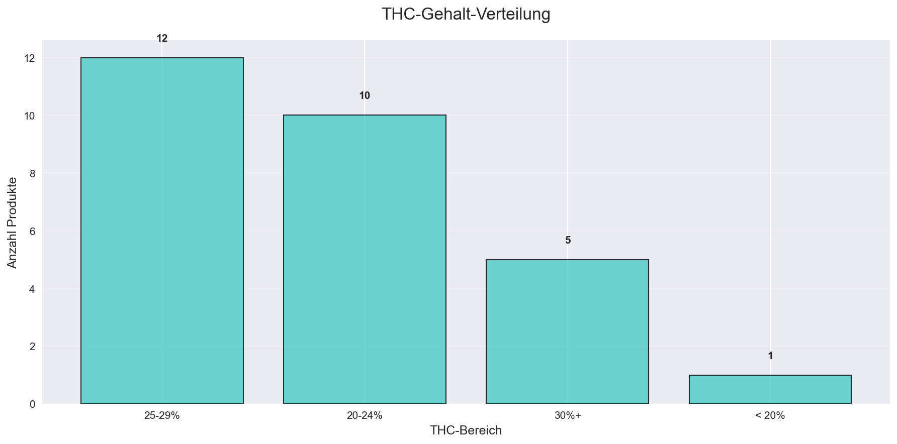
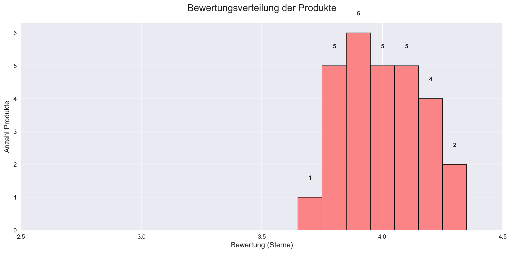

# 📊 WeedDB Datenvisualisierungen

Diese Seite enthält automatisch generierte Diagramme und Visualisierungen der WeedDB-Daten.
**Letzte Aktualisierung:** 15.11.2025 01:31

## 📈 Preisverläufe

### Top-Produkte Preisverlauf

*Preisverlauf der 5 meistbewerteten Produkte über die letzten 30 Tage*

## 🧬 Produktverteilungen

### Genetik-Verteilung

*Verteilung der Genetik-Typen (Indica, Sativa, Hybrid) in der Datenbank*

### THC-Gehalt-Verteilung

*Verteilung der THC-Prozentsätze in verschiedenen Bereichen*

### Bewertungsverteilung

*Verteilung der Kundenbewertungen (1-5 Sterne)*

## 📋 Statistiken Übersicht

| Metrik | Wert |
|--------|------|
| Gesamtprodukte | 32 |
| Durchschnittliche Bewertung | 3.98 ⭐ |
| Höchster THC-Gehalt | 30%+ |
| Niedrigster THC-Gehalt | < 20% |

## 🔄 Automatische Generierung

Diese Diagramme werden automatisch mit dem Skript `generate_charts.py` erstellt:

```bash
python3 scripts/generate_charts.py
```

Das Skript sollte nach jeder größeren Datenbank-Aktualisierung ausgeführt werden, um die Visualisierungen aktuell zu halten.
